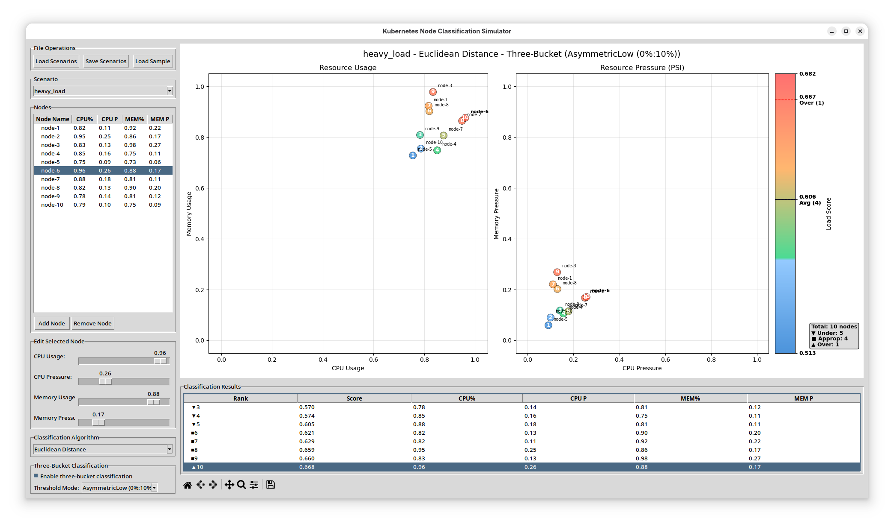

# Kubernetes Node Classification Simulator

A comprehensive simulator for Kubernetes node classification algorithms that allows you to compare different approaches for ordering nodes from least loaded to most loaded. Features both traditional ranking and three-bucket utilization classification.

## Features

### Core Functionality
- **Node representation**: Each K8s node has name, CPU usage percentage (0-1), CPU PSI pressure (0-1), memory usage percentage (0-1), memory PSI pressure (0-1)
- **Classification algorithms**: Extensible framework with eight pre-implemented algorithms
- **Realistic data generation**: Uses 70% utilization threshold rule for authentic pressure modeling
- **JSON scenarios**: Load/save scenarios with multiple test cases

### Classification Modes
- **Traditional ranking**: Orders nodes from least to most loaded
- **Three-bucket classification**: Categorizes nodes as under-utilized, appropriately-utilized, or over-utilized using dynamic thresholds

### Command Line Interface
- Batch processing of JSON scenarios
- Support for both ranking and three-bucket classification modes
- Multiple threshold modes (Low, Medium, High, AsymmetricLow, AsymmetricMedium, AsymmetricHigh)

### Interactive GUI
- **Real-time editing**: Drag nodes in plots or use sliders to adjust parameters
- **Dual visualization**: Side-by-side scatter plots (Usage vs Pressure)
- **Three-bucket visualization**: Custom color gradients (blue→light blue→green→orange→red)
- **Smart colorbar**: Shows thresholds, cluster averages, and node counts for each bucket
- **Multiple scenarios**: Switch between light_load, mixed_load, heavy_load, and realistic_progression

## Installation

```bash
pip install -r requirements.txt
```

## Usage

### Command Line Interface

```bash
# Generate sample scenarios file
python cli.py --generate-sample

# Run traditional ranking on all algorithms
python cli.py --file sample_scenarios.json

# Run three-bucket classification with AsymmetricLow thresholds (default)
python cli.py --file sample_scenarios.json --classify

# Use different threshold modes
python cli.py --file sample_scenarios.json --classify --threshold-mode high
python cli.py --file sample_scenarios.json --classify --threshold-mode asym-medium

# List available algorithms
python cli.py --list-algorithms
```

### GUI

```bash
python gui.py
```

**Default Settings**: Opens with mixed_load scenario (12 nodes) and Euclidean Distance algorithm for immediate meaningful results.

#### GUI Features:
- **Load/save scenarios** from JSON files
- **Edit node parameters** in real-time with sliders or drag-and-drop in plots
- **Dual scatter plots**: Resource Usage (CPU% vs Memory%) and Resource Pressure (CPU PSI vs Memory PSI)
- **Three-bucket classification** with dynamic thresholds and visual feedback
- **Interactive selection**: Click any node to highlight across all panels
- **Algorithm comparison**: Switch between algorithms to see different rankings
- **Threshold tuning**: Adjust three-bucket classification sensitivity
- **Visual feedback**: Color-coded nodes with rank numbers and bold highlighting

### GUI Screenshot



*Interactive GUI showing dual scatter plots with three-bucket classification. Features include: (1) dual visualization of resource usage and pressure metrics, (2) smart colorbar with node counts and thresholds, (3) real-time parameter editing with sliders, (4) bidirectional selection across panels, (5) algorithm comparison dropdown, and (6) three-bucket classification controls with dynamic threshold modes.*

## Implemented Algorithms

1. **Weighted Average**: Balanced weighted average of all four metrics
2. **Max Metric**: Uses the maximum value among all metrics (identifies bottlenecks)
3. **Euclidean Distance**: Geometric distance from origin (0,0,0,0) - great for overall load
4. **Pressure Focused**: Prioritizes PSI pressure metrics (identifies stressed nodes)
5. **Weighted RMS Positive Deviation**: Cluster-relative algorithm focusing on nodes above average with weighted RMS calculation (weights: 0.15 for usage, 0.35 for pressure metrics)
6. **Pareto Front (NSGA-II)**: Multi-objective optimization using non-dominated sorting and crowding distance to find optimal trade-offs across all metrics
7. **Resource Type (CPU)**: CPU-focused algorithm considering usage and pressure
8. **Resource Type (Memory)**: Memory-focused algorithm considering usage and pressure

## Three-Bucket Classification

### Threshold Modes
- **Low (10%:10%)**: Conservative thresholds
- **Medium (20%:20%)**: Balanced thresholds
- **High (30%:30%)**: Aggressive thresholds
- **AsymmetricLow (0%:10%)**: No under-utilized threshold, 10% over-utilized
- **AsymmetricMedium (0%:20%)**: No under-utilized threshold, 20% over-utilized
- **AsymmetricHigh (0%:30%)**: No under-utilized threshold, 30% over-utilized

### Categories
- **Under-utilized** (▼): Nodes significantly below cluster average
- **Appropriately-utilized** (■): Nodes within normal range of cluster average
- **Over-utilized** (▲): Nodes significantly above cluster average

## Sample Scenarios

The simulator includes four realistic scenarios:

1. **light_load**: 6 nodes with low utilization (10-30%), minimal pressure
2. **mixed_load**: 12 nodes with varied utilization (25-95%), mixed pressure patterns
3. **heavy_load**: 10 nodes with high utilization (75-95%), significant pressure
4. **realistic_progression**: 8 nodes showing gradual load increase with authentic pressure curves

## JSON Scenario Format

```json
{
  "scenario_name": [
    {
      "name": "node1",
      "cpu_usage": 0.5,
      "cpu_pressure": 0.2,
      "memory_usage": 0.7,
      "memory_pressure": 0.1
    }
  ]
}
```

## Project Structure

- `node.py`: Node class representing K8s nodes with metric validation
- `algorithms.py`: Classification algorithm framework and implementations
- `classifier.py`: Three-bucket classification system with dynamic thresholds
- `scenario_loader.py`: JSON scenario loading/saving with realistic data generation
- `cli.py`: Command-line interface supporting both ranking and classification modes
- `gui.py`: Interactive GUI with dual plots, drag-and-drop editing, and real-time visualization

## Technical Highlights

### Realistic Pressure Modeling
- **70% threshold rule**: Pressure remains minimal below 70% utilization, then grows exponentially
- **Authentic relationships**: CPU and memory pressure correlate realistically with utilization
- **Variance modeling**: Small random variations simulate real-world monitoring data

### Advanced GUI Features
- **Centralized selection management**: Prevents circular event loops during cross-panel highlighting
- **Dynamic colorbar**: Shows threshold values, cluster averages, and node counts with visual symbols
- **Real-time parameter editing**: Drag nodes or use sliders with immediate visualization updates
- **Custom color gradients**: Three-segment colormap for intuitive bucket visualization

### Extensible Architecture
- **Algorithm interface**: Easy to add new classification algorithms
- **Threshold configuration**: Flexible dynamic threshold calculation
- **Scenario management**: Simple JSON format for sharing test cases