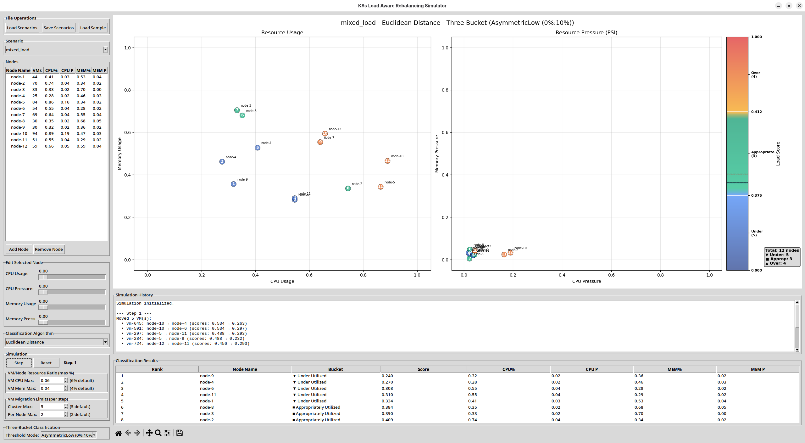

# K8s Load Aware Rebalancing Simulator

A comprehensive simulator for load-aware rebalancing of KubeVirt VMs running on Kubernetes. This tool simulates how the Descheduler redistributes VMs based on node load classification, allowing you to compare different algorithms and threshold strategies for optimal cluster balance.

## Features

### Core Functionality
- **Node representation**: Each K8s node has name, CPU usage percentage (0-1), CPU PSI pressure (0-1), memory usage percentage (0-1), memory PSI pressure (0-1)
- **Classification algorithms**: Extensible framework with eight pre-implemented algorithms
- **Realistic data generation**: Uses 70% utilization threshold rule for authentic pressure modeling
- **JSON scenarios**: Load/save scenarios with multiple test cases

### Classification Modes
- **Traditional ranking**: Orders nodes from least to most loaded
- **Three-bucket classification**: Categorizes nodes as under-utilized, appropriately-utilized, or over-utilized using dynamic thresholds

### Command Line Interface
- Batch processing of JSON scenarios
- Support for both ranking and three-bucket classification modes
- Multiple threshold modes (Low, Medium, High, AsymmetricLow, AsymmetricMedium, AsymmetricHigh)

### Interactive GUI
- **Real-time editing**: Drag nodes in plots or use sliders to adjust parameters
- **Dual visualization**: Side-by-side scatter plots (Usage vs Pressure)
- **Three-bucket visualization**: Custom color gradients (blue→light blue→green→orange→red)
- **Smart colorbar**: Shows thresholds, cluster averages, and node counts for each bucket
- **Multiple scenarios**: Switch between light_load, mixed_load, heavy_load, and simple_progression
- **VM-based simulation**: Step-by-step finite state simulator with VM tracking and descheduler

## Installation

```bash
pip install -r requirements.txt
```

## Usage

### Command Line Interface

```bash
# Generate sample scenarios file
python cli.py --generate-sample

# Run traditional ranking on all algorithms
python cli.py --file sample_scenarios.json

# Run three-bucket classification with AsymmetricLow thresholds (default)
python cli.py --file sample_scenarios.json --classify

# Use different threshold modes
python cli.py --file sample_scenarios.json --classify --threshold-mode high
python cli.py --file sample_scenarios.json --classify --threshold-mode asym-medium

# List available algorithms
python cli.py --list-algorithms
```

### GUI

```bash
python gui.py
```

**Default Settings**: Opens with mixed_load scenario (12 nodes) and Euclidean Distance algorithm for immediate meaningful results.

#### GUI Features:
- **Load/save scenarios** from JSON files
- **Edit node parameters** in real-time with sliders or drag-and-drop in plots
- **Dual scatter plots**: Resource Usage (CPU% vs Memory%) and Resource Pressure (CPU PSI vs Memory PSI)
- **Three-bucket classification** with dynamic thresholds and visual feedback
- **Interactive selection**: Click any node to highlight across all panels
- **Algorithm comparison**: Switch between algorithms to see different rankings
- **Threshold tuning**: Adjust three-bucket classification sensitivity
- **Visual feedback**: Color-coded nodes with rank numbers and bold highlighting

### GUI Screenshot



*Interactive GUI showing dual scatter plots with three-bucket classification. Features include: (1) dual visualization of resource usage and pressure metrics, (2) smart colorbar with node counts and thresholds, (3) real-time parameter editing with sliders, (4) bidirectional selection across panels, (5) algorithm comparison dropdown, (6) three-bucket classification controls with dynamic threshold modes, and (7) simulation history panel with detailed action log for each step.*

## Implemented Algorithms

1. **Weighted Average**: Balanced weighted average of all four metrics
2. **Max Metric**: Uses the maximum value among all metrics (identifies bottlenecks)
3. **Euclidean Distance**: Geometric distance from origin (0,0,0,0) - great for overall load
4. **Pressure Focused**: Prioritizes PSI pressure metrics (identifies stressed nodes)
5. **Weighted RMS Positive Deviation**: Cluster-relative algorithm focusing on nodes above average with weighted RMS calculation (weights: 0.15 for usage, 0.35 for pressure metrics)
6. **Pareto Front (NSGA-II)**: Multi-objective optimization using non-dominated sorting and crowding distance to find optimal trade-offs across all metrics
7. **Centroid Distance**: Measures distance from cluster center in 4D space - identifies outliers (Note: treats under-utilized and over-utilized nodes equally if at same distance from center)
8. **Directional Centroid Distance**: Measures only positive deviations from cluster center - ensures overutilized nodes rank higher than underutilized nodes (better for load-aware rebalancing)
9. **Variance Minimization**: Cluster balancing algorithm that penalizes any deviation from cluster mean (PSI pressure metrics weighted 2x as "alarm bells": CPU/Memory usage weight 1.0, CPU/Memory pressure weight 2.0) - Note: treats under-utilized and over-utilized nodes equally if at same distance from mean
10. **Directional Variance Minimization**: Cluster balancing algorithm that only penalizes positive deviations from cluster mean - ensures overutilized nodes rank higher than underutilized nodes (PSI pressure weighted 2x, usage 1x)
11. **Resource Type (CPU)**: CPU-focused algorithm considering usage and pressure
12. **Resource Type (Memory)**: Memory-focused algorithm considering usage and pressure

## Three-Bucket Classification

### Threshold Modes
Thresholds are defined as absolute offsets from the cluster average score:
- **Low (10%:10%)**: Conservative thresholds - under if score ≤ (avg - 0.10), over if score ≥ (avg + 0.10)
- **Medium (20%:20%)**: Balanced thresholds - under if score ≤ (avg - 0.20), over if score ≥ (avg + 0.20)
- **High (30%:30%)**: Aggressive thresholds - under if score ≤ (avg - 0.30), over if score ≥ (avg + 0.30)
- **AsymmetricLow (0%:10%)**: No under-utilized threshold (score ≤ avg), over if score ≥ (avg + 0.10)
- **AsymmetricMedium (0%:20%)**: No under-utilized threshold (score ≤ avg), over if score ≥ (avg + 0.20)
- **AsymmetricHigh (0%:30%)**: No under-utilized threshold (score ≤ avg), over if score ≥ (avg + 0.30)

### Categories
- **Under-utilized** (▼): Nodes with scores below (cluster_average - lower_threshold)
- **Appropriately-utilized** (■): Nodes with scores within the threshold range
- **Over-utilized** (▲): Nodes with scores above (cluster_average + upper_threshold)

## KubeVirt VM Rebalancing Simulator

This simulator models how the Kubernetes Descheduler redistributes KubeVirt VMs across nodes based on load-aware classification. It provides step-by-step visualization of VM migrations and their impact on cluster balance.

### How It Works

1. **KubeVirt VM Tracking**: Each K8s node runs KubeVirt VMs with unique IDs and specific resource consumption
   - Each VM consumes random amounts: 0-6% CPU, 0-4% memory (as percentage of node resources)
   - VMs maintain their resource footprint when migrated between nodes
   - Node utilization = sum of all VM consumption on that node
   - **Note**: VM consumption is relative to the node capacity, not absolute values

2. **Load-Aware Classification**: At each step, nodes are classified into three categories using the selected algorithm and threshold mode
   - **Under-utilized**: Nodes with available capacity that can accept VMs
   - **Appropriately-utilized**: Nodes with balanced load
   - **Over-utilized**: Nodes that should offload VMs to reduce pressure

3. **Descheduler VM Migration**: The Descheduler redistributes VMs from over-utilized to under-utilized nodes
   - Configurable cluster-wide limit: up to 5 VMs per step (adjustable 1-50)
   - Configurable per-node limit: maximum 2 VMs from any single node per step (adjustable 1-20)
   - Randomly selects VMs from over-utilized nodes
   - **Randomly selects destination nodes** from under-utilized nodes (mimics actual Kubernetes scheduler behavior, which is not load-aware)
   - **Memory constraint**: Nodes reject VMs if memory would exceed 100% (non-compressible resource)
   - **CPU flexibility**: CPU can exceed 100% (compressible resource - VMs slow down but continue running)

4. **Metric Updates**: After VM migrations, node CPU/memory utilization and PSI pressure are recalculated
   - Utilization = sum of all VMs running on the node
   - **PSI pressure estimation**: CPU and memory pressure are automatically estimated using heuristics based on utilization levels
   - Pressure increases dramatically as utilization approaches limits (exponential growth 90-100%)
   - **Manual pressure override**: Users can manually adjust PSI pressure values at any time via sliders to evaluate classifier behavior under different pressure scenarios

### Using the Simulator

The simulator is always active in the GUI. To use it:
1. Load a scenario (e.g., "mixed_load" with 12 nodes)
2. Adjust VM/Node resource ratios (default: 6% CPU, 4% memory per VM)
3. Configure migration limits (default: 5 VMs per cluster step, 2 per node)
4. Click "Step" to execute one simulation step and observe VM migrations
5. View detailed migration history showing VM movements and utilization changes
6. Click "Reset" to return to the initial state

### Simulation History

The history panel shows for each step:
- VM movements with IDs: `vm-42: node-3 → node-5`
- Score changes: `(scores: 0.850 → 0.420)`
- Utilization deltas: `node-3: CPU 0.75→0.73 (-0.02), MEM 0.40→0.36 (-0.04)`
- Classification summary: `3 under, 6 appropriate, 3 over`

### Key Characteristics

- **Realistic VM diversity**: Mixed CPU/memory ratios prevent uniform node behavior
- **Memory protection**: Hard limit at 100% memory (realistic constraint)
- **Pressure modeling**: Exponential pressure growth at high utilization
- **History tracking**: Full audit trail of all VM movements
- **Configurable limits**: Adjustable per-node and per-cluster VM movement limits

## Sample Scenarios

The simulator includes four realistic scenarios:

1. **light_load**: 6 nodes with low utilization (10-30%), minimal pressure
2. **mixed_load**: 12 nodes with varied utilization (25-95%), mixed pressure patterns - **default scenario**
3. **heavy_load**: 10 nodes with high utilization (75-95%), significant pressure
4. **simple_progression**: 8 nodes showing gradual load increase from 10% to 95% (useful for understanding threshold behavior)

## JSON Scenario Format

```json
{
  "scenario_name": [
    {
      "name": "node1",
      "cpu_usage": 0.5,
      "cpu_pressure": 0.2,
      "memory_usage": 0.7,
      "memory_pressure": 0.1,
      "vms": [
        {
          "id": "vm-1",
          "cpu_consumption": 0.03,
          "memory_consumption": 0.02
        },
        {
          "id": "vm-2",
          "cpu_consumption": 0.05,
          "memory_consumption": 0.04
        }
      ]
    }
  ]
}
```

**Note**: The `vms` field contains the individual VMs running on each node with their specific resource consumption. When you save scenarios from the GUI or generate them via CLI, VMs are automatically included to ensure reproducibility of exact VM configurations across sessions.

## Project Structure

- `node.py`: Node and VM classes representing K8s nodes with metric validation and VM tracking
- `algorithms.py`: Classification algorithm framework and implementations
- `classifier.py`: Three-bucket classification system with dynamic thresholds
- `scenario_loader.py`: JSON scenario loading/saving with realistic data generation and VM creation
- `simulator.py`: Finite state simulator with VM tracking, descheduler logic, and history management
- `cli.py`: Command-line interface supporting both ranking and classification modes
- `gui.py`: Interactive GUI with dual plots, drag-and-drop editing, simulation mode, and real-time visualization

## Technical Highlights

### Realistic Pressure Modeling
- **70% threshold rule**: Pressure remains minimal below 70% utilization, then grows exponentially
- **Authentic relationships**: CPU and memory pressure correlate realistically with utilization
- **Variance modeling**: Small random variations simulate real-world monitoring data

### Advanced GUI Features
- **Centralized selection management**: Prevents circular event loops during cross-panel highlighting
- **Dynamic colorbar**: Shows threshold values, cluster averages, and node counts with visual symbols
- **Real-time parameter editing**: Drag nodes or use sliders with immediate visualization updates
- **Custom color gradients**: Three-segment colormap for intuitive bucket visualization

### Extensible Architecture
- **Algorithm interface**: Easy to add new classification algorithms
- **Threshold configuration**: Flexible dynamic threshold calculation
- **Scenario management**: Simple JSON format for sharing test cases